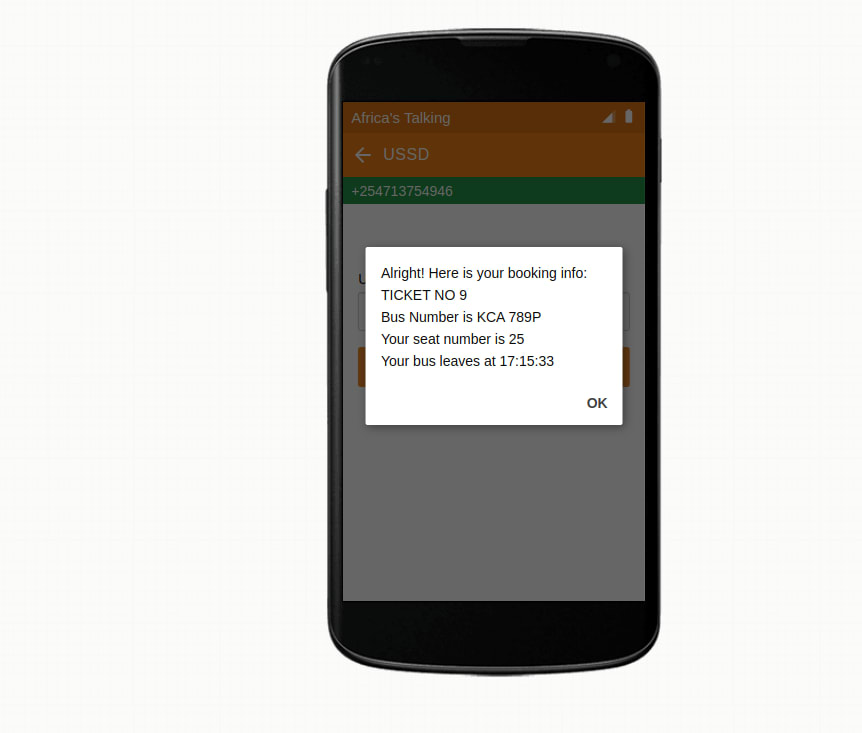

## PROJECT SCREEN


## Getting started
These instructions will get you a copy of the project up and running in your local machine for development and testing purposes.

## Prerequisites
- [Git](https://git-scm.com/download/)
- [Python 3.6 and above](https://www.python.org/downloads/)
- [PostgreSQL](https://www.postgresql.org/)

## Installing
### Setting up the database
- Start your database server and create your database

### Setting up and Activating a Virtual Environment
- Create a working space in your local machine
- Clone this [repository](https://github.com/nicksonlangat/bus_project_api_v1.git) `git clone https://github.com/nicksonlangat/bus_project_api_v1.git`
- Navigate to the project directory
- Create a virtual environment `python3 -m venv name_of_your_virtual_environment` and activate it `source name_of_your_virtual_environment/bin/activate`
- Create a .env file in root directory and put these key=values in it:
```
DEBUG=on
SECRET_KEY='your secret key'
DB_NAME="your_db_name"
DB_USER="your_postgres_username"
DB_PASSWORD="your_postgres_password"
DB_PORT="your_postgres_port"
DB_HOST="localhost or any other host name"
```
- Install dependencies to your virtual environment `pip install -r requirements.txt`
- Migrate changes to the newly created database `python manage.py migrate`

## Starting the server
- Ensure you are in the project directory on the same level with `manage.py` and the virtual environment is activated
- Run the server `python manage.py runserver`

## PROJECT MODULES
- The project configs and settings is in the folder `mysite`
- Main app is `core`. It communicates with AfricasTalking APIs via a ngrok webhook.
- Start ngrok by `ngrok http 8000` to expose `localhost` to the internet.